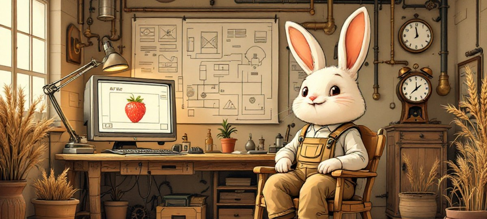
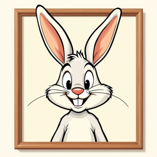
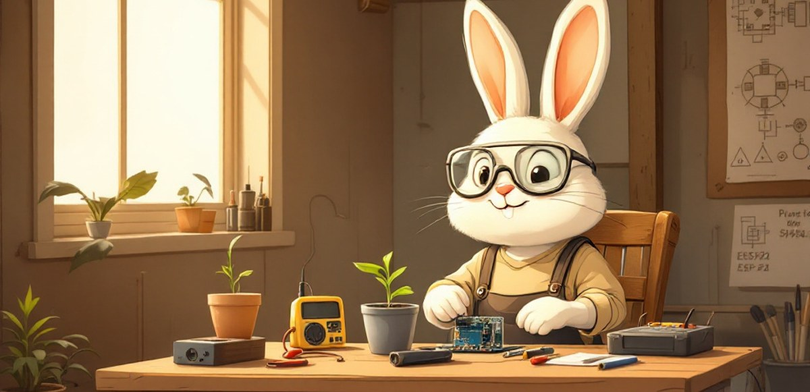

  

  

  <a href="https://buraktas.online"><b>buraktas.online</b></a>
  &nbsp;·&nbsp;
  <a href="https://www.youtube.com/@burakbuilds1"><b>YouTube</b></a>
  &nbsp;·&nbsp;
  <a href="https://x.com/br0think"><b>X</b></a>
  &nbsp;·&nbsp;
  <a href="https://aurelionlabs.digital"><b>AurelionLabs</b></a>
  &nbsp;·&nbsp;
  <a href="https://www.upwork.com/freelancers/~01037d26d993c938e9"><b>Upwork</b></a>

 

## What I'm building now

<table>
  <tr>
    <td valign="top">
      FLAGSHIP · IN ACTIVE DEVELOPMENT
      <h2><a href="https://buraktas.online/#projeler">SeraOS</a></h2>
      
<strong>Fully autonomous care for a single plant — with no human in the loop.</strong>

      

        Water, light, temperature and humidity are read by sensors and handled by actuators
        (pump, grow LED, fan). It runs completely offline — autonomy first; cloud and a mobile
        app come later.
      

      

        Built on an ESP32 brain under a watchdog and sensor fail-safes: dry-run pump lock,
        DLI-based lighting, VPD-aware climate control, and a LiPo UPS so the brain survives
        power cuts and resumes exactly where it left off.
      

      

        <code>ESP32</code>&nbsp; <code>SENSOR FUSION</code>&nbsp; <code>LoRa / IoT</code>&nbsp; <code>OFFLINE-FIRST</code>
      

      
<a href="https://buraktas.online/#projeler"><b>project details →</b></a>

    </td>
  </tr>
</table>

 

<table>
  <tr>
    <td width="66%" valign="middle">
      <h2>I ship ambitious AI builds — from scratch, in public.</h2>
      

        Every week I build a new AI-driven project using tools like Cursor, Claude, OpenAI and
        modern stacks. Biosystems engineer by training, I bring code to the soil: computer vision,
        embedded systems and autonomous machines for agriculture.
      

      

        <code>AI SYSTEMS</code>&nbsp; <code>COMPUTER VISION</code>&nbsp; <code>EMBEDDED</code>&nbsp; <code>AGRITECH</code>&nbsp; <code>OPEN BUILDS</code>
      

    </td>
    <td width="34%" align="center" valign="middle">
      
       
      <b>THE RABBIT</b> · fast &amp; precise
    </td>
  </tr>
</table>

 

## Selected projects

| Project | What it is |
| --- | --- |
| **[SeraOS](https://buraktas.online/#projeler)** | Autonomous single-plant system — ESP32, sensor fusion, offline-first |
| **[AgriVision](https://buraktas.online/#projeler)** | Strawberry quality control — computer-vision conveyor + robotic sorting |
| **[TEKNOFEST · Tarımda Terminal](https://buraktas.online/#projeler)** | Wireless sensor network over 100+ dönüm — Arduino + LoRa, solar-powered |
| **[BAGGL](https://buraktas.online/#projeler)** | Desktop automation bot — Python + Selenium + SQLite |

 

### Toolbox

  <code>Python</code> &nbsp; <code>C/C++ · ESP32/Arduino</code> &nbsp; <code>OpenCV</code> &nbsp; <code>TensorFlow Lite</code> &nbsp; <code>LoRa · IoT</code> &nbsp; <code>SolidWorks · 3D print</code> &nbsp; <code>Astro</code> &nbsp; <code>Git</code>

 

  

  Building useful, sometimes weird software in public — raw, inspectable, exactly as it ran. 🐇

