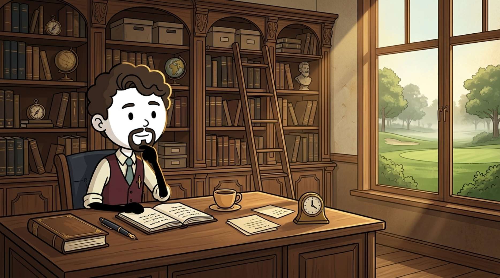

  

<h3 align="center">Biosystems & Agricultural Engineer building practical AI for agriculture 🌱</h3>

  Computer vision · Swift & app development · Remote sensing · Edge AI · Open source

### 🏆 Highlights

- 🌾 **Agricultural domain expertise** — turning plant, field, and sensor data into practical engineering tools.
- 🛰️ **Agritech builder** — developing explainable workflows for crop monitoring, satellite time series, and autonomous systems.
- 📱 **App developer** — building practical, user-focused applications with Swift.
- 🤝 **Open-source contributor** — contributing focused tests, tooling, and fixes to scientific Python and geospatial projects.

### 💻 Tech Stack & Field Tools

  
  
  
  
  
  
  
  
  

### 📊 Current Focus

- 🔭 **Building:** [HasadHaber](https://github.com/BuraakAI/harvest_time_estimate), an explainable satellite time-series prototype for estimating winter-wheat harvest windows.
- 📱 **Developing:** native applications with Swift, focused on clear interfaces and practical workflows.
- 🌱 **Exploring:** plant phenotyping, vegetation indices, and agricultural computer vision with Python and OpenCV.
- ⚙️ **Prototyping:** offline-first sensing and control systems with ESP32, Arduino, and LoRa.
- 🤝 **Contributing:** test-backed improvements to scientific Python, geospatial, and imaging projects.

### 🚜 Featured Work

- **[HasadHaber](https://github.com/BuraakAI/harvest_time_estimate)** — explainable harvest-window estimation using Sentinel-1/2 time series and Google Earth Engine.
- **[SeraOS](https://buraktas.online/#projeler)** — offline-first sensing and control for autonomous plant care.
- **[AgriVision](https://buraktas.online/#projeler)** — computer-vision quality control and robotic sorting for agricultural products.

### 📫 Let's Connect

  
  
  
  

### 📈 GitHub Stats

  

